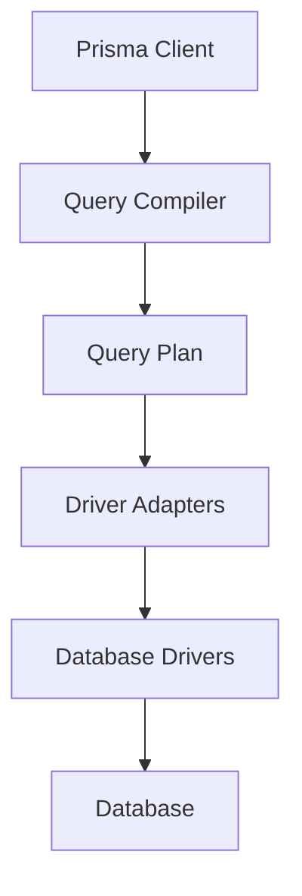

## Overview

Prisma Engines follows a modular architecture with clear separation of concerns. The system is built around a **core/connector pattern** where core logic is implemented once and database-specific behavior is handled by connectors.


## Architecture Principles

### Core / Connector Pattern

Both the Schema Engine and Query stack expose the same API across all supported databases. This is achieved through:

- **Core crates** - Define the common API and orchestrate functionality
- **Connector crates** - Implement database-specific behavior

The Schema Engine core is a thin orchestration layer in `schema-core` that coordinates functionality provided by connectors. Each supported database has its own connector implementing the `schema-connector` API. Most of the actual migration and introspection logic lives in these connectors.

<Note>
  Currently, all connectors are built-in and live in the prisma-engines repository, but the architecture supports external connectors in the future.
</Note>

## Query Compiler

Prisma Client now executes queries through a modern **Query Compiler (QC)** architecture that separates planning from execution.

### Architecture

The query stack consists of three layers:



#### 1. Query Compiler (Rust)

**Location:** `query-compiler/`

The Rust query compiler:
- Consumes the DataModel (DML) from PSL
- Produces **query plans** describing SQL and orchestration steps
- Handles query optimization and planning
- Compiles to WebAssembly for JavaScript runtime

Key crates:
- `query-compiler` - Main compilation logic
- `query-core` - Core query processing
- `query-structure` - Query AST and data structures
- `query-builder` - SQL generation
- `sql-query-builder` - Database-specific SQL builders

#### 2. Driver Adapters (TypeScript)

**Location:** `libs/driver-adapters/`

Driver adapters wrap database drivers in JavaScript:
- Load and interpret query plans from the compiler
- Execute SQL through Node.js/edge database drivers
- Handle transaction management
- Provide compatibility with existing tooling

The `@prisma/client-engine-runtime` package (in the main Prisma repo) implements the query plan interpreter.

#### 3. Query Plan Execution

Query plans describe:
- SQL queries to execute
- Orchestration steps (joins, transformations)
- Transaction boundaries
- Result mapping

The TypeScript runtime interprets these plans and executes them through driver adapters, enabling:
- Support for serverless databases (Neon, PlanetScale)
- Edge runtime compatibility (Cloudflare Workers, Vercel Edge)
- Custom database drivers

<Warning>
  There is no standalone query engine binary anymore. The compatibility harness lives in JavaScript and is bundled using `make build-driver-adapters-kit-qc`.
</Warning>

### Development Workflow

When working on the query stack, you typically touch three layers:

1. **Rust planner logic** - `query-compiler`, `query-core`, `query-structure`
2. **Driver adapter executor** - `libs/driver-adapters/executor`
3. **Integration tests** - `cargo test -p query-engine-tests` (via `make dev-*-qc`)

## Schema Engine

**Location:** `schema-engine/`

The Schema Engine is responsible for database schema management and migrations.

### Core Functionality

The Schema Engine provides three main capabilities:

#### 1. Migration Generation (Diffing)

Compares Prisma schema with current database state to generate migrations:

```rust
// High-level flow
1. Connect to shadow database
2. Apply existing migrations to shadow DB
3. Introspect shadow DB schema (starting point)
4. Calculate expected schema from Prisma file
5. Diff starting point vs expected schema
6. Generate migration SQL
```

<Note>
  The shadow database is the only mechanism by which Migrate can determine what migrations do. Migrate treats migration files as black boxes and doesn't parse SQL.
</Note>

#### 2. Migration Execution

Runs migrations and tracks applied migrations in the `_prisma_migrations` table:

```sql
CREATE TABLE _prisma_migrations (
    id                      VARCHAR(36) PRIMARY KEY NOT NULL,
    checksum                VARCHAR(64) NOT NULL,
    finished_at             TIMESTAMPTZ,
    migration_name          VARCHAR(255) NOT NULL,
    logs                    TEXT,
    rolled_back_at          TIMESTAMPTZ,
    started_at              TIMESTAMPTZ NOT NULL DEFAULT now(),
    applied_steps_count     INTEGER NOT NULL DEFAULT 0
);
```

**Key fields:**
- `checksum` - SHA256 of migration file (detects modifications)
- `finished_at` - NULL means migration failed or is in progress
- `rolled_back_at` - Set by `prisma migrate resolve --rolled-back`
- `started_at` - When migration execution began

#### 3. Introspection

Generates Prisma schema files from existing databases:

```bash
prisma db pull
```

The engine connects to your database, reads the schema, and generates a Prisma schema file representing your database structure.

### Migration Workflow

<Steps>
  <Step title="Development">
    Run `prisma migrate dev` to:
    - Check for drift between migrations and database
    - Generate new migration if schema changed
    - Apply migration to development database
    - Regenerate Prisma Client
  </Step>
  
  <Step title="Review">
    - Review generated SQL in `prisma/migrations/`
    - Edit migration file if needed (add custom SQL)
    - Commit migration to version control
  </Step>
  
  <Step title="Deployment">
    Run `prisma migrate deploy` in production to:
    - Compare migrations directory with `_prisma_migrations` table
    - Apply any unapplied migrations in order
    - Never reset database or require shadow database
  </Step>
</Steps>

### Components

Key crates in the Schema Engine:

- **`schema-core`** - Core orchestration and API
- **`schema-connector`** - Connector trait definitions
- **`sql-schema-connector`** - SQL database connector implementation
- **`mongodb-schema-connector`** - MongoDB connector
- **`sql-schema-describer`** - Reads SQL database schemas
- **`mongodb-schema-describer`** - Reads MongoDB schemas
- **`datamodel-renderer`** - Generates Prisma schema syntax
- **`json-rpc-api`** - JSON-RPC protocol for CLI communication

### Why No Down Migrations?

Prisma Migrate uses a **forward-only migration** approach:

<AccordionGroup>
  <Accordion title="In Development">
    Down migrations aren't needed because `migrate dev`:
    - Detects drift automatically
    - Offers to reset development database
    - Makes iteration easier than manual rollbacks
  </Accordion>
  
  <Accordion title="In Production">
    Down migrations give false sense of security:
    - May not work if migration partially failed
    - Can't restore dropped data
    - May fail on non-reversible changes
    - Untested rollback code is risky under pressure
    
    **Better approach:**
    - Use expand-and-contract pattern
    - Roll forward instead of back
    - Use `migrate resolve` for manual recovery
  </Accordion>
</AccordionGroup>

<Warning>
  Migrations are not wrapped in transactions by default for determinism and flexibility. Add `BEGIN;` and `COMMIT;` manually where appropriate.
</Warning>

## Prisma Schema Language (PSL)

**Location:** `psl/`

PSL is the foundation that all engines build upon.

### Crate Structure

The PSL implementation follows a clean dependency graph:

```
diagnostics → schema-ast → parser-database → psl-core → psl
```

- **`diagnostics`** - Error and warning types
- **`schema-ast`** - Abstract Syntax Tree for Prisma schemas
- **`parser-database`** - Semantic analysis and validation
- **`psl-core`** - Core PSL functionality and connector definitions
- **`psl`** - Public API used by other engines

### Usage Across Engines

- **Schema Engine** - Validates schemas, reads datasource configuration
- **Prisma Format** - Formats schemas, provides LSP features
- **Query Compiler** - Consumes DataModel (DML) for query planning

The **DataModel (DML)** is an annotated version of PSL that includes resolved relations, computed fields, and additional metadata needed for query compilation.

## Prisma Format

**Location:** `prisma-fmt/`

Prisma Format provides:

- **Schema formatting** - Consistent style for `.prisma` files
- **Language Server Protocol (LSP)** - IDE features like autocomplete, go-to-definition, diagnostics
- **Validation** - Real-time schema validation
- **WebAssembly module** - Browser and Node.js support via `prisma-schema-wasm`

### LSP Features

- Code completion for models, fields, attributes
- Real-time error diagnostics
- Go to definition
- Hover information
- Rename refactoring

## Driver Adapters

**Location:** `libs/driver-adapters/`

Driver adapters enable Prisma to work with various database drivers and runtimes.

### Supported Adapters

- **`pg`** - PostgreSQL (node-postgres)
- **`neon`** - Neon serverless PostgreSQL
- **`planetscale`** - PlanetScale serverless MySQL
- **`libsql`** - Turso/libSQL SQLite
- **`better-sqlite3`** - SQLite
- **`d1`** - Cloudflare D1

### Architecture

Driver adapters consist of:

1. **Rust side** (`libs/driver-adapters/src/`) - Types and utilities
2. **TypeScript side** (in main Prisma repo) - Actual adapter implementations
3. **Executor harness** (`libs/driver-adapters/executor/`) - Test execution

The connector test kit (`query-engine/connector-test-kit-rs`) exercises the full stack end-to-end by spawning the executor process and driving requests through adapters.

## Shared Libraries

**Location:** `libs/`

Common functionality used across engines:

- **`quaint`** - Database abstraction layer and query builder
- **`user-facing-errors`** - Standardized error messages for users
- **`prisma-value`** - Value types representing database values
- **`test-setup`** - Test database provisioning
- **`sql-ddl`** - SQL DDL generation utilities
- **`telemetry`** - Metrics and tracing
- **`mongodb-client`** - MongoDB connection handling

## Testing Architecture

Prisma Engines has comprehensive test coverage:

### Unit Tests

Run unit tests for the entire workspace:

```bash
make test-unit
```

Unit tests are located in `tests/` folders throughout the codebase.

### Integration Tests

**Schema Engine:**
- `sql-migration-tests` - Migration generation and execution
- `sql-introspection-tests` - Database introspection

**Query Compiler:**
- `query-engine-tests` - End-to-end query execution tests
- `core-tests` - Query compiler unit tests

Integration tests require database connections and use `insta` for snapshot testing.

### Test Configuration

Tests use either environment variables or a `.test_config` file:

```json
{
  "connector": "postgres",
  "version": "15"
}
```

Makefile helpers set up databases and configuration:
- `make dev-postgres15` - PostgreSQL 15
- `make dev-pg-qc` - PostgreSQL with query compiler
- `make dev-mysql8` - MySQL 8

## Build System

The project uses Cargo workspaces with:

- **Workspace dependencies** - Centralized in root `Cargo.toml`
- **Feature flags** - Control compilation of optional functionality
- **Release profiles** - Optimized for size with LTO
- **WebAssembly targets** - Special build for query compiler and schema engine

### Key Build Commands

```bash
# Build all engines
cargo build --release

# Build query compiler WebAssembly
make build-qc-wasm

# Build driver adapters kit
make build-driver-adapters-kit-qc

# Build schema engine
cargo build -p schema-engine-cli
```

## CI/CD Pipeline

The engines integrate with the broader Prisma ecosystem:

1. **Test** - Full test suite runs on all supported databases
2. **Build** - Engines compiled for multiple platforms
3. **Release** - Engines published to S3 and R2
4. **Integration** - Triggers `prisma/prisma` integration tests
5. **Publish** - NPM packages updated with new engine versions

<Note>
  Branches starting with `integration/` automatically trigger the full release pipeline for testing in the main Prisma repository.
</Note>
