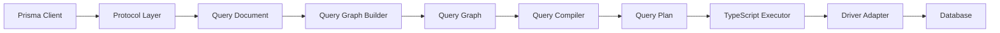

## Overview

The Query Compiler is the core component responsible for translating Prisma Client queries into executable query plans. It's a key part of Prisma 7's new architecture, where query planning happens in Rust and execution runs in TypeScript through driver adapters.

<Note>
The Query Compiler replaced the native Rust query engine in Prisma 7. It separates query planning (Rust) from query execution (TypeScript/driver adapters).
</Note>

## Architecture

The Query Compiler follows a multi-stage compilation pipeline:

<CardGroup cols={2}>
  <Card title="Query Document" icon="file-lines">
    Intermediate representation of the input that decouples the protocol layer from the query engine
  </Card>
  <Card title="Query Graph" icon="project-diagram">
    Directed graph representing query operations and their dependencies
  </Card>
  <Card title="Query AST" icon="code-branch">
    Abstract syntax tree for executable database operations
  </Card>
  <Card title="Query Plan" icon="list-check">
    Final expression tree sent to the TypeScript interpreter for execution
  </Card>
</CardGroup>

## Core Components

### Query Document

The Query Document is an intermediate representation that helps decouple the incoming protocol layer from the query engine. This allows the query engine to remain agnostic to the actual protocol used (GraphQL, JSON-RPC, etc.).

```rust
pub enum QueryDocument {
    Single(Operation),
    Multi(BatchDocument),
}

pub enum BatchDocument {
    Multi(Vec<Operation>, Option<BatchDocumentTransaction>),
    Compact(CompactedDocument),
}
```

**Key features:**
- Supports single and batch operations
- Batch query compaction for performance optimization
- Protocol-agnostic design

<Tip>
The Query Document can automatically compact multiple `findUnique` queries into a single `findMany` query for better performance, as long as they share the same operation name and selection set.
</Tip>

### Query Graph

The Query Graph is a directed graph structure built from the Query Document. It represents the execution flow and dependencies between different query operations.

```rust
pub enum Node {
    /// Nodes representing actual queries to the underlying connector
    Query(Query),
    
    /// Flow control nodes
    Flow(Flow),
    
    /// General computation nodes (don't invoke the connector)
    Computation(Computation),
    
    /// Empty node
    Empty,
}

pub enum Flow {
    /// Conditional control flow with 'then' and 'else' edges
    If { rule: DataRule, data: Vec<SelectionResult> },
    
    /// Returns a fixed set of results at runtime
    Return(Vec<SelectionResult>),
}
```

**Node Types:**
- **Query nodes**: Represent actual database operations
- **Flow nodes**: Handle conditional logic and control flow
- **Computation nodes**: Perform data transformations (e.g., diffs)
- **Empty nodes**: Placeholders in the graph structure

### Query Graph Builder

The Query Graph Builder transforms the Query Document into an executable Query Graph:

```rust
pub struct QueryGraphBuilder {
    // Internal state for building the graph
}

pub type QueryGraphBuilderResult<T> = Result<T, QueryGraphBuilderError>;
```

Located in `query-compiler/core/src/query_graph_builder/`, it handles:
- **Read operations**: SELECT queries, findUnique, findMany, etc.
- **Write operations**: CREATE, UPDATE, DELETE operations
- **Input extraction**: Parsing and validating query arguments
- **Relation loading**: Managing nested query execution

### Query AST

The Query AST represents the final, executable form of queries before they're sent to the database:

- **Read queries**: `findUnique`, `findMany`, aggregate operations
- **Write queries**: `create`, `update`, `delete`, `upsert`
- **Nested operations**: Relation traversals and nested writes

## Request Flow

The complete flow from Prisma Client to database execution:



1. **Client Request**: Prisma Client generates a query request
2. **Query Document**: Request is parsed into intermediate representation
3. **Graph Building**: Query Graph is constructed from the document
4. **Compilation**: Graph is compiled into a query plan (expression tree)
5. **Execution**: TypeScript interpreter executes the plan via driver adapters
6. **Database**: Driver adapters communicate with the actual database

<Note>
Unlike the legacy architecture, the Query Compiler has no knowledge of connection strings or database credentials. All database communication happens through driver adapters in TypeScript.
</Note>

## Key Features

### Batch Query Optimization

The Query Compiler can automatically optimize multiple similar queries:

```typescript
// Multiple findUnique queries
const [user1, user2, user3] = await Promise.all([
  prisma.user.findUnique({ where: { id: 1 } }),
  prisma.user.findUnique({ where: { id: 2 } }),
  prisma.user.findUnique({ where: { id: 3 } }),
])

// Automatically compacted into a single findMany query:
// SELECT * FROM User WHERE id IN (1, 2, 3)
```

### Protocol Agnostic

The Query Document abstraction allows the engine to work with different protocols:

- **GraphQL**: Traditional mapping from GraphQL queries
- **JSON-RPC**: Direct JSON-based protocol
- **Future protocols**: Easy to add new protocol adapters

### Relation Load Strategies

Supports multiple strategies for loading related data:

- **JOIN**: Use SQL JOINs for related data
- **QUERY**: Use separate queries for relations
- **Auto**: Automatically choose based on query characteristics

## Modules

The Query Compiler is organized into several crates:

| Crate | Purpose | Location |
|-------|---------|----------|
| `query-core` | Core compilation logic | `query-compiler/core/` |
| `query-structure` | Data model abstractions | `query-compiler/query-structure/` |
| `query-compiler` | Main compiler orchestration | `query-compiler/query-compiler/` |
| `query-builders` | Query plan builders | `query-compiler/query-builders/` |
| `schema` | Query schema building | `query-compiler/schema/` |
| `request-handlers` | Protocol handlers | `query-compiler/request-handlers/` |
| `dmmf` | Data Model Meta Format | `query-compiler/dmmf/` |

## Testing

### Core Tests

The `query-compiler/core-tests` crate contains comprehensive unit tests:

```bash
# Run core tests
cargo test -p query-core

# Update snapshots
UPDATE_EXPECT=1 cargo test -p query-core
```

### Integration Tests

The connector test kit provides end-to-end testing:

```bash
# Build Query Compiler WASM
make build-qc-wasm

# Build driver adapters kit
make build-driver-adapters-kit-qc

# Run connector tests
cargo test -p query-engine-tests -- --nocapture
```

<Tip>
Use `RENDER_DOT_TO_PNG=1` when testing to generate visual representations of query graphs (requires Graphviz).
</Tip>

## WebAssembly

The Query Compiler compiles to WebAssembly for execution in browser and edge environments:

```bash
# Build the WASM module
make build-qc-wasm

# Location: query-compiler/query-compiler-wasm
```

**WASM capabilities:**
- Query planning in the browser
- Edge runtime support (Cloudflare Workers, Vercel Edge, etc.)
- Reduced bundle size compared to native binaries

## Playground

The Query Compiler Playground allows interactive exploration of query plans:

```bash
# Run the playground
cargo run -p query-compiler-playground
```

**Features:**
- Visualize query graphs
- Inspect query plans
- Generate GraphViz diagrams
- Debug compilation stages

## Migration from Legacy Engine

<Warning>
The native Rust query engine has been removed in favor of the Query Compiler architecture. MongoDB support is not yet available and will be added in a future release.
</Warning>

### Key Differences

| Aspect | Legacy Engine | Query Compiler |
|--------|--------------|----------------|
| **Execution** | Rust native code | TypeScript + driver adapters |
| **Database access** | Direct connection | Through driver adapters |
| **Protocol** | GraphQL over HTTP | Query plans (JSON) |
| **Connection strings** | Engine manages | Client manages |
| **MongoDB** | Supported | Not yet implemented |

## Error Handling

The Query Compiler provides detailed error types:

```rust
pub type Result<T> = std::result::Result<T, CoreError>;

pub enum CoreError {
    // Various error types
}

pub struct ExtendedUserFacingError {
    // User-friendly error information
}
```

Errors are transformed into user-facing messages with:
- Clear error messages
- Source location information
- Suggestions for fixes
- Error codes for programmatic handling

## Related Components

- [Schema Engine](/components/schema-engine) - Handles migrations and introspection
- [Prisma Schema Language](/components/psl) - Defines and validates Prisma schemas
- [Prisma Format](/components/prisma-fmt) - Provides formatting and LSP features

## Source Code

Explore the Query Compiler source code:

- **Main crate**: `query-compiler/query-compiler/`
- **Core logic**: `query-compiler/core/src/`
- **Tests**: `query-compiler/core-tests/`
- **Repository**: [prisma/prisma-engines](https://github.com/prisma/prisma-engines)
