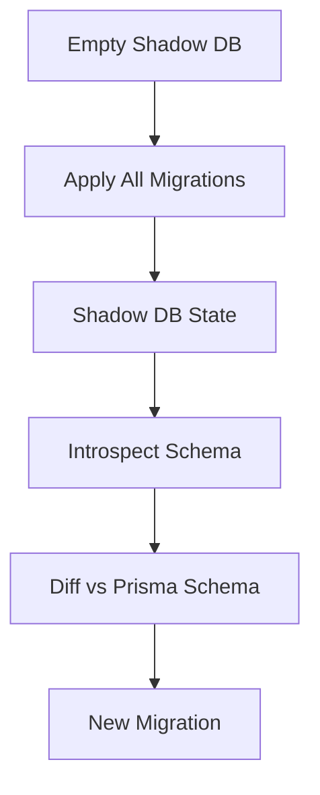

## Overview

The Schema Engine is the component behind [Prisma Migrate](https://www.prisma.io/docs/concepts/components/prisma-migrate). It handles database schema migrations, introspection, and all schema-related operations.

<Note>
The Schema Engine is called by the TypeScript CLI in [prisma/prisma](https://github.com/prisma/prisma) through both direct CLI commands and a JSON-RPC API.
</Note>

## Architecture

### Core/Connector Pattern

The Schema Engine uses a layered architecture that separates database-agnostic logic from database-specific implementations:

<CardGroup cols={2}>
  <Card title="Schema Core" icon="layer-group">
    Database-agnostic API and orchestration logic
  </Card>
  <Card title="Connectors" icon="plug">
    Database-specific migration and introspection implementations
  </Card>
</CardGroup>

```rust
// Core defines the interface
pub trait SchemaConnector {
    async fn create_migration(&self, params: CreateMigrationParams) -> Result<Migration>;
    async fn apply_migrations(&self, params: ApplyMigrationsParams) -> Result<ApplyResult>;
    async fn introspect(&self, params: IntrospectParams) -> Result<Schema>;
    // ... more methods
}

// Each database implements the connector trait
// - PostgreSQL connector
// - MySQL connector
// - SQLite connector
// - SQL Server connector
// - MongoDB connector
```

## Core Functionality

The Schema Engine has two main blocks of functionality:

### 1. Traditional Migration System

Like ActiveRecord migrations or Flyway, the Schema Engine:
- Creates migration files (SQL on SQL databases)
- Applies migrations to databases
- Tracks applied migrations in the `_prisma_migrations` table
- Handles migration failures and recovery

### 2. Schema Diffing

The Schema Engine can understand database schemas and generate migrations:
- Your Prisma schema is in state A
- Your database is in state B
- The engine generates a migration from B to A
- This powers `prisma migrate dev`

<Tip>
Schema diffing uses a **shadow database** to determine what migrations do. The engine applies all existing migrations to the shadow database, then diffs it against the Prisma schema to generate the next migration.
</Tip>

## Directory Structure

The Schema Engine code is organized as follows:

```
schema-engine/
├── cli/              # Executable binary and CLI interface
├── core/             # Core logic shared across connectors
├── connectors/       # Database-specific implementations
│   ├── schema-connector/     # Connector trait definition
│   ├── sql-schema-connector/ # SQL database connector
│   └── mongodb-schema-connector/  # MongoDB connector
├── commands/         # Command implementations
├── sql-migration-tests/      # Migration test suite
├── sql-introspection-tests/  # Introspection test suite
└── sql-schema-describer/     # Database schema reading
```

## The Migrations Table

The `_prisma_migrations` table tracks migration state:

```sql
CREATE TABLE _prisma_migrations (
    id                      VARCHAR(36) PRIMARY KEY NOT NULL,
    checksum                VARCHAR(64) NOT NULL,
    finished_at             TIMESTAMPTZ,
    migration_name          VARCHAR(255) NOT NULL,
    logs                    TEXT,
    rolled_back_at          TIMESTAMPTZ,
    started_at              TIMESTAMPTZ NOT NULL DEFAULT now(),
    applied_steps_count     INTEGER NOT NULL DEFAULT 0
);
```

**Column descriptions:**

| Column | Purpose |
|--------|--------|
| `id` | Random unique identifier (UUID v4) |
| `checksum` | SHA256 hash of the migration file |
| `finished_at` | Completion timestamp (NULL = incomplete) |
| `migration_name` | Complete name of the migration directory |
| `logs` | Error messages in case of failure |
| `rolled_back_at` | Set by `prisma migrate resolve --rolled-back` |
| `started_at` | When migration execution began |
| `applied_steps_count` | Deprecated |

<Note>
If `finished_at` is NULL and `rolled_back_at` is NULL, the migration failed and hasn't been resolved.
</Note>

## Available Commands

The Schema Engine exposes these commands:

### Migration Commands

<CardGroup cols={2}>
  <Card title="create_migration" icon="file-plus">
    Generate a new migration file by diffing the Prisma schema against the current database state
  </Card>
  <Card title="apply_migrations" icon="play">
    Apply pending migrations to the database (used by `migrate deploy`)
  </Card>
  <Card title="mark_migration_applied" icon="check">
    Mark a migration as applied without running it
  </Card>
  <Card title="mark_migration_rolled_back" icon="rotate-left">
    Mark a migration as rolled back
  </Card>
</CardGroup>

### Diagnostic Commands

<CardGroup cols={2}>
  <Card title="diagnose_migration_history" icon="stethoscope">
    Check migration history for issues and inconsistencies
  </Card>
  <Card title="dev_diagnostic" icon="bug">
    Development-specific diagnostics (used by `migrate dev`)
  </Card>
  <Card title="evaluate_data_loss" icon="triangle-exclamation">
    Analyze a migration for potential data loss
  </Card>
  <Card title="diff" icon="code-compare">
    Compare two database schemas and show differences
  </Card>
</CardGroup>

### Other Commands

<CardGroup cols={2}>
  <Card title="introspect_sql" icon="magnifying-glass">
    Reverse-engineer a Prisma schema from an existing database
  </Card>
  <Card title="schema_push" icon="upload">
    Push schema changes directly without creating migration files (dev only)
  </Card>
</CardGroup>

## API Protocols

The Schema Engine supports two interaction modes:

### 1. Direct CLI Commands

Some commands are exposed directly:

```bash
schema-engine cli create-database --datasource="{...}"
schema-engine cli drop-database --datasource="{...}"
```

### 2. JSON-RPC API

Most commands use the JSON-RPC protocol (default when running `schema-engine`):

```json
{
  "jsonrpc": "2.0",
  "method": "applyMigrations",
  "params": {
    "migrationsDirectoryPath": "./prisma/migrations"
  },
  "id": 1
}
```

<Note>
The JSON-RPC API allows the TypeScript CLI to issue multiple commands on the same connection, enabling better performance and state management.
</Note>

## Logging

The Schema Engine logs JSON-structured messages to stderr:

```typescript
interface StdErrLine {
  timestamp: string;
  level: LogLevel;  // "INFO" | "ERROR" | "DEBUG" | "WARN"
  fields: LogFields;
}

interface LogFields {
  message: string;
  
  // Only for ERROR level
  is_panic?: boolean;
  error_code?: string;
  
  [key: string]: any;
}
```

### Exit Codes

- `0`: Normal exit
- `1`: Abnormal (error) exit
- `101`: Panic

<Warning>
Non-zero exit codes should always be accompanied by an ERROR-level log message on stderr.
</Warning>

## Shadow Database

The shadow database is crucial for migration generation:

### How It Works

1. Connect to the shadow database (or create a temporary one)
2. Erase all schema in the shadow database
3. Apply all existing migrations to the shadow database
4. Introspect the shadow database schema
5. Diff the shadow database against the Prisma schema
6. The diff becomes the next migration



<Tip>
Set `shadowDatabaseUrl` in your datasource to use a specific shadow database. Otherwise, the engine creates a temporary one.
</Tip>

### When Is It Used?

- **Migration generation**: `prisma migrate dev`
- **Not used** by `prisma migrate deploy` (production deployments)

## Connector Implementations

### SQL Connectors

Located in `schema-engine/connectors/sql-schema-connector/`:

- PostgreSQL
- MySQL
- MariaDB
- SQLite
- SQL Server
- CockroachDB

**Features:**
- DDL generation for schema changes
- Migration script validation
- Database-specific type mapping
- Constraint handling
- Index management

### MongoDB Connector

Located in `schema-engine/connectors/mongodb-schema-connector/`:

- Collection introspection
- Schema validation rules
- Index management
- No traditional migrations (MongoDB is schema-flexible)

## Testing

### Unit Tests

```bash
# Run core unit tests
make test-unit

# Test specific package
cargo test -p schema-core
```

### Integration Tests

Migration and introspection tests require database URLs:

```bash
# Source database URLs (PostgreSQL example)
source .test_database_urls/postgres

# Run migration tests
cargo test -p sql-migration-tests -- --nocapture

# Run introspection tests
cargo test -p sql-introspection-tests -- --nocapture
```

<Tip>
The `.test_database_urls/` directory contains helper scripts to set up environment variables for each database.
</Tip>

### Test API

Integration tests use a test harness:

```rust
use schema_engine_tests::*;

#[test]
fn migration_with_shadow_database() {
    let api = TestApi::new_engine_with_connection_strings(
        connection_string,
        Some(shadow_connection),
    );
    
    // Test migration operations
}
```

## Common Workflows

### Development Flow (`migrate dev`)

1. User modifies Prisma schema
2. CLI calls `devDiagnostic` to check for drift
3. If drift detected, may reset dev database
4. Calls `createMigration` to generate migration file
5. Calls `applyMigrations` to apply to dev database
6. User reviews and commits the migration

### Production Deployment (`migrate deploy`)

1. CLI calls `applyMigrations` with migrations directory
2. Engine checks `_prisma_migrations` table
3. Applies any unapplied migrations in order
4. Updates `_prisma_migrations` table
5. Returns success or failure

<Note>
`migrate deploy` never resets the database and never uses a shadow database. It's designed for unattended, deterministic deployments.
</Note>

### Failed Migration Recovery

1. Migration fails during `migrate deploy`
2. Row in `_prisma_migrations` has `started_at` but no `finished_at`
3. Subsequent `migrate deploy` commands fail with error
4. User must fix the issue manually
5. User runs `prisma migrate resolve --applied <name>` or `--rolled-back <name>`
6. Engine updates `_prisma_migrations` table
7. Migrations can continue

## Design Philosophy

### Why No Down Migrations?

Prisma Migrate does not have automatic down migrations by design:

**In development:**
- Migrate will detect drift and offer to reset your dev database
- Better than manually writing down migrations

**In production:**
- Down migrations often don't work (partial failures, data loss, etc.)
- Manual recovery with `migrate resolve` is more reliable
- Recommended: [Expand and contract pattern](https://www.prisma.io/dataguide/types/relational/expand-and-contract-pattern)
- Roll forward, not backward

### Why No Transactions by Default?

Migrations are not wrapped in transactions automatically:

- **Determinism**: Same behavior in dev and production
- **Flexibility**: Users can add `BEGIN`/`COMMIT` if desired
- **Consistency**: Not supported on all databases (e.g., MySQL)
- **Performance**: Large migrations are lighter without transactions

<Tip>
You can manually wrap migration contents in `BEGIN;` and `COMMIT;` statements for transactional behavior where supported.
</Tip>

## Connection String Overrides

In Prisma 7, datasource URLs are no longer in the schema:

```rust
// Schema engine accepts connection info via CLI
schema-engine --datasource='{"url": "postgresql://...", "shadowDatabaseUrl": "postgresql://..."}'

// Test API wrapper
let api = TestApi::new_engine_with_connection_strings(
    connection_string,
    Some(shadow_connection),
);
```

See `AGENTS.md` in the source repository for details.

## Related Components

- [Query Compiler](/components/query-compiler) - Compiles and executes database queries
- [Prisma Schema Language](/components/psl) - Defines and validates Prisma schemas
- [Prisma Format](/components/prisma-fmt) - Provides schema formatting and LSP features

## Source Code

Explore the Schema Engine source code:

- **Main crate**: `schema-engine/cli/`
- **Core logic**: `schema-engine/core/`
- **Commands**: `schema-engine/commands/src/commands/`
- **Architecture docs**: `schema-engine/ARCHITECTURE.md`
- **Repository**: [prisma/prisma-engines](https://github.com/prisma/prisma-engines)
