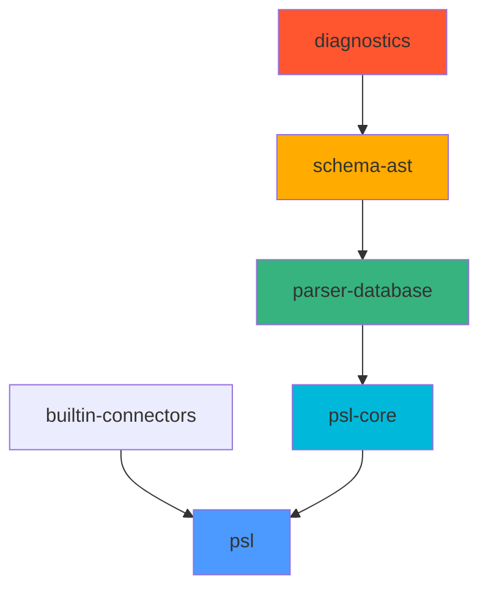

# Prisma Schema Language (PSL)

The Prisma Schema Language (PSL) is the core parser, validator, and formatter for Prisma schemas. It provides the foundation for all schema-related operations across the Prisma ecosystem.

## What is PSL?

PSL is the implementation of the Prisma Schema Language - a declarative language for defining database models, relations, and configuration. The PSL crates are responsible for:

- **Parsing** schema files into an Abstract Syntax Tree (AST)
- **Validating** schemas against connector-specific rules and constraints
- **Analyzing** schema structure and relationships
- **Formatting** and reformatting schema code
- **Providing APIs** for other Prisma engines to work with schemas

<Note>
  PSL is connector-agnostic at its core. Database-specific validations and features are handled through the connector trait system.
</Note>

## Architecture Overview

The PSL implementation is organized into several focused crates with a clear dependency hierarchy:



### Crate Dependency Graph

The dependency structure is intentionally simple and linear:

```
diagnostics →
schema-ast →
parser-database →
psl-core
builtin-connectors →
psl
```

<Info>
  The **dml** crate is a separate data structure that can optionally be produced ("lifted") from a validated schema. It's not part of the main dependency chain.
</Info>

## Core Crates

### diagnostics

Provides error and warning reporting with source span information:

- `DatamodelError` - Error types with source locations
- `DatamodelWarning` - Warning types
- `Diagnostics` - Collection of errors and warnings
- `Span` and `FileId` - Source location tracking
- Pretty-printing utilities for user-facing error messages

### schema-ast

The Abstract Syntax Tree representation:

- Faithfully represents Prisma Schema syntax with source spans
- Built using the Pest parser generator
- Supports single and multi-file schemas
- Provides AST nodes for models, fields, attributes, enums, etc.

**Key exports:**
- `parse_schema()` - Parse string to AST
- `reformat()` - Format schema code
- `SourceFile` - File content wrapper

### parser-database

Connector-agnostic semantic analysis:

- Resolves names to IDs for all schema items
- Resolves types for fields and type aliases
- Validates attributes on models and fields
- Performs global validations (e.g., index name collisions)
- Provides walker APIs for traversing validated schemas

**Validation phases:**
1. Name resolution
2. Type resolution
3. Attribute validation
4. Global validations

<Note>
  ParserDatabase never fails - it accumulates as much information as possible and returns diagnostics alongside incomplete but usable results.
</Note>

### psl-core

The core implementation entry point:

- Defines the `Connector` trait for database-specific behavior
- Implements validation pipeline
- Provides configuration parsing
- Handles datasource and generator blocks
- Coordinates connector-specific validations

**Key traits:**
- `Connector` - Database connector interface
- `ExtensionTypes` - Custom type system extensions

### builtin-connectors

Implements connectors for supported databases:

- **PostgreSQL** - Full featured connector with extensions support
- **MySQL** - Including PlanetScale compatibility
- **SQLite** - Embedded database support
- **SQL Server** - Microsoft SQL Server connector
- **CockroachDB** - Distributed SQL database
- **MongoDB** - Document database (limited QC support)

Each connector implements:
- Native type mappings
- Capability flags
- Database-specific validations
- Referential action support

### psl

The public API crate - the main entry point used by other engines:

```rust
use psl::parse_schema;

let validated_schema = parse_schema(&schema_string)?;
```

**Main APIs:**
- `parse_schema()` - Full parsing and validation
- `parse_configuration()` - Parse only datasource/generator blocks
- `validate()` - Validation with error tolerance
- `reformat()` - Code formatting

## Usage Example

Parsing and validating a schema:

```rust
use psl::parse_schema_without_extensions;

let schema = r#"
  datasource db {
    provider = "postgresql"
  }
  
  model User {
    id    Int    @id @default(autoincrement())
    email String @unique
    posts Post[]
  }
  
  model Post {
    id       Int  @id @default(autoincrement())
    authorId Int
    author   User @relation(fields: [authorId], references: [id])
  }
"#;

let validated = parse_schema_without_extensions(schema)?;
// Access validated schema through walker APIs
```

## Integration Points

PSL is used throughout the Prisma ecosystem:

- **Query Compiler** - Processes schemas to produce client API and DMMF JSON
- **Schema Engine** - Powers migrations and introspection
- **prisma-fmt** - Language server and formatter
- **Prisma CLI** - Schema validation and configuration

## Testing

Run the test suite:

```bash
# All PSL tests
cargo test -p psl -F all

# Validation tests (declarative)
cargo test -p psl --test validation_tests

# Reformat tests
cargo test -p psl --test reformat_tests

# Update snapshots
UPDATE_EXPECT=1 cargo test -p psl
```

<Info>
  PSL uses declarative testing where `.prisma` files in `tests/validation/` are automatically validated and their errors are compared against comment expectations.
</Info>

## Key Design Principles

1. **Connector Agnostic Core** - Database-specific logic lives in connectors
2. **Error Tolerance** - Validation accumulates diagnostics without failing
3. **Source Fidelity** - AST preserves exact source locations for errors
4. **Simple Dependencies** - Linear dependency graph prevents cycles
5. **Walker Pattern** - Type-safe traversal of validated schemas

## Next Steps

<CardGroup cols={2}>
  <Card title="Parser Implementation" icon="code" href="/psl/parser">
    Deep dive into the parser and schema-ast
  </Card>
  <Card title="Validation" icon="check" href="/psl/validation">
    Learn about validation and parser-database
  </Card>
  <Card title="Connectors" icon="database" href="/psl/connectors">
    Explore database connectors and capabilities
  </Card>
  <Card title="Contributing" icon="code-pull-request" href="https://github.com/prisma/prisma-engines/blob/main/psl/CONTRIBUTING.md">
    Contributing guide for PSL development
  </Card>
</CardGroup>
