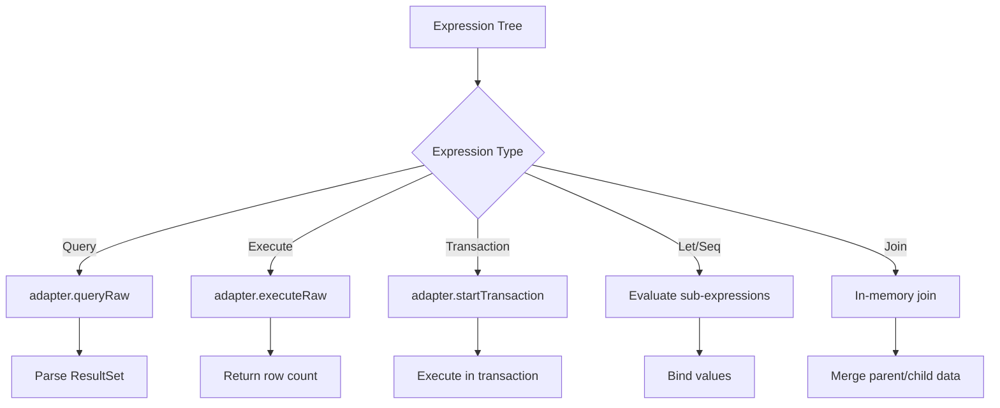

Driver adapters bridge the gap between Rust-compiled query plans and database-specific TypeScript drivers. They enable Prisma to run in any JavaScript environment with appropriate database connectivity.

## Overview

The driver adapter system allows the Query Compiler to target different databases and environments:

- **PostgreSQL**: `pg`, `@neondatabase/serverless`, `@prisma/adapter-pg`
- **MySQL**: `mysql2`, `@planetscale/database`, `@prisma/adapter-mysql`
- **SQLite**: `better-sqlite3`, `@libsql/client`, Cloudflare D1
- **SQL Server**: `tedious`, `@prisma/adapter-mssql`

## Architecture

<Tabs>
  <Tab title="Rust Side">
    The Rust side provides WASM bindings and connection info abstraction:

    ```rust
    use quaint::connector::ConnectionInfo;
    use query_compiler::compile;

    pub fn compile(
        query_schema: &QuerySchema,
        query: Operation,
        connection_info: &ConnectionInfo,
    ) -> Result<Expression, CompileError>
    ```

    Connection info tells the compiler which SQL dialect to generate without requiring actual database access.
  </Tab>

  <Tab title="TypeScript Side">
    The TypeScript side executes the plan using driver adapters:

    ```typescript
    interface SqlDriverAdapter {
      queryRaw(params: Query): Promise<Result<ResultSet>>
      executeRaw(params: Query): Promise<Result<number>>
      startTransaction(): Promise<Result<SqlDriverTransaction>>
    }
    ```

    The interpreter walks the expression tree and calls adapter methods as needed.
  </Tab>
</Tabs>

## Driver Adapter Manager

The `DriverAdaptersManager` interface standardizes driver setup:

```typescript
export interface DriverAdaptersManager {
  /**
   * Access the Driver Adapter factory
   */
  factory: () => SqlDriverAdapterFactory

  /**
   * Creates a queryable instance from the Driver Adapter factory,
   * attempting a connection to the database.
   */
  connect: () => Promise<SqlDriverAdapter>

  /**
   * Closes the connection to the database and cleans up any used resources.
   */
  teardown: () => Promise<void>

  /**
   * Returns the connector used by the Manager.
   */
  connector: () => Env['CONNECTOR']
}
```

From `libs/driver-adapters/executor/src/driver-adapters-manager/index.ts`

## Example: PostgreSQL Adapter

Here's how the `pg` adapter is implemented:

```typescript
import { PrismaPg } from '@prisma/adapter-pg'
import type {
  SqlMigrationAwareDriverAdapterFactory,
  SqlDriverAdapter,
} from '@prisma/driver-adapter-utils'
import { postgresSchemaName, postgresOptions } from '../utils.js'
import type { DriverAdaptersManager } from './index.js'

export class PgManager implements DriverAdaptersManager {
  #factory: SqlMigrationAwareDriverAdapterFactory
  #adapter?: SqlDriverAdapter

  private constructor(
    private env: EnvForAdapter<'pg'>,
    { url }: SetupDriverAdaptersInput,
  ) {
    const schemaName = postgresSchemaName(url)
    this.#factory = new PrismaPg(postgresOptions(url), {
      schema: schemaName,
    })
  }

  static async setup(env: EnvForAdapter<'pg'>, input: SetupDriverAdaptersInput) {
    return new PgManager(env, input)
  }

  factory() {
    return this.#factory
  }

  async connect() {
    return (this.#adapter ??= await this.#factory.connect())
  }

  async teardown() {
    await this.#adapter?.dispose()
  }

  connector(): Env['CONNECTOR'] {
    // could be 'postgresql' or 'cockroachdb'
    return this.env.CONNECTOR
  }
}
```

From `libs/driver-adapters/executor/src/driver-adapters-manager/pg.ts`

## Supported Adapters

<CardGroup cols={2}>
  <Card title="PostgreSQL" icon="elephant">
    - `@prisma/adapter-pg` (node-postgres)
    - `@prisma/adapter-neon` (Neon serverless)
    - `@prisma/adapter-pg-worker` (Cloudflare Workers)
  </Card>

  <Card title="MySQL" icon="database">
    - `@prisma/adapter-mysql` (mysql2)
    - `@prisma/adapter-planetscale` (PlanetScale serverless)
    - `@prisma/adapter-mariadb`
  </Card>

  <Card title="SQLite" icon="cube">
    - `@prisma/adapter-better-sqlite3`
    - `@prisma/adapter-libsql` (Turso)
    - `@prisma/adapter-d1` (Cloudflare D1)
  </Card>

  <Card title="SQL Server" icon="server">
    - `@prisma/adapter-mssql` (tedious)
  </Card>
</CardGroup>

## Building the Driver Adapters Kit

The driver adapters are built separately from the query compiler:

<Steps>
  <Step title="Ensure Prisma repository is available">
    The build process requires the main Prisma repository for adapter packages:

    ```bash
    make ensure-prisma-present
    ```

    This clones `prisma/prisma` to `../prisma` if not already present.
  </Step>

  <Step title="Install dependencies">
    ```bash
    make install-driver-adapters-kit-deps
    ```

    Runs `pnpm i` in the driver adapters directory.
  </Step>

  <Step title="Build for Query Compiler">
    ```bash
    make build-driver-adapters-kit-qc
    ```

    This runs `pnpm build:qc` which builds only the packages needed for query compiler tests.
  </Step>
</Steps>

From the `Makefile`:

```makefile
install-driver-adapters-kit-deps: build-driver-adapters
	cd libs/driver-adapters && pnpm i

build-driver-adapters-kit-qc: install-driver-adapters-kit-deps
	cd libs/driver-adapters && pnpm build:qc

build-driver-adapters: ensure-prisma-present
	@echo "Building driver adapters..."
	@cd ../prisma && pnpm i
	@echo "Driver adapters build completed.";
```

## Testing with Driver Adapters

The connector test kit can run against any driver adapter:

<Tabs>
  <Tab title="PostgreSQL + pg">
    ```bash
    make dev-pg-qc
    cargo test -p query-engine-tests
    ```

    This:
    1. Starts PostgreSQL via Docker
    2. Builds query-compiler-wasm
    3. Builds driver adapters kit
    4. Sets up test config for pg adapter
  </Tab>

  <Tab title="SQLite + libsql">
    ```bash
    make dev-libsql-qc
    cargo test -p query-engine-tests -- --test-threads 1
    ```

    Tests run single-threaded for SQLite to avoid database locking issues.
  </Tab>

  <Tab title="MySQL + PlanetScale">
    ```bash
    make dev-planetscale-qc
    cargo test -p query-engine-tests -- --test-threads 1
    ```
  </Tab>

  <Tab title="SQL Server">
    ```bash
    make dev-mssql-qc
    cargo test -p query-engine-tests
    ```
  </Tab>
</Tabs>

## Connection Info Types

The WASM compiler needs to know the provider without having a real connection:

```typescript
export type AdapterProvider =
  | 'postgresql'
  | 'mysql'
  | 'sqlite'
  | 'sqlserver'
  | 'cockroachdb'

export interface JsConnectionInfo {
  supports_relation_joins: boolean
  // Additional provider-specific options
}
```

In the WASM constructor:

```rust
pub struct QueryCompilerParams {
    datamodel: String,
    provider: AdapterProvider,
    connection_info: JsConnectionInfo,
}

#[wasm_bindgen(constructor)]
pub fn new(params: QueryCompilerParams) -> Result<QueryCompiler, JsError> {
    let schema = Arc::new(psl::parse_without_validation(
        datamodel.into(),
        CONNECTOR_REGISTRY,
        &NoExtensionTypes,
    ));
    
    Ok(Self {
        schema,
        connection_info: ConnectionInfo::External(
            connection_info.into_external_connection_info(provider)
        ),
        protocol: EngineProtocol::Json,
    })
}
```

From `query-compiler-wasm/src/compiler.rs`

## Expression Execution Flow

When the TypeScript interpreter executes a plan:



## Relation Join Strategies

Driver adapters support different relation loading strategies:

<Tabs>
  <Tab title="Query Strategy">
    Load relations in separate queries (application-level joins):

    ```bash
    PRISMA_RELATION_LOAD_STRATEGY=query make dev-pg-qc
    ```

    Generates a `Join` expression in the plan.
  </Tab>

  <Tab title="Join Strategy">
    Use SQL JOINs when the database supports it:

    ```bash
    PRISMA_RELATION_LOAD_STRATEGY=join make dev-pg-qc
    ```

    Generates SQL with JOIN clauses.
  </Tab>
</Tabs>

## Migration Script Support

Some adapters (like Cloudflare D1) support migration scripts:

```typescript
export type SetupDriverAdaptersInput = {
  url: string
  
  /**
   * The `prisma migrate diff --script` output to apply migrations.
   * This is a temporary workaround only used by Cloudflare D1.
   */
  migrationScript?: string
}
```

## Benchmarking

Benchmark driver adapter performance:

```bash
make bench-pg-js
```

This:
1. Sets up a PostgreSQL instance via Docker
2. Runs JavaScript benchmarks comparing adapter performance

## Next Steps

<CardGroup cols={2}>
  <Card title="Query Planning" icon="sitemap" href="/query-compiler/query-planning">
    Learn how queries are planned and optimized
  </Card>

  <Card title="WASM Build" icon="cube" href="/query-compiler/wasm-build">
    Build the WebAssembly module
  </Card>
</CardGroup>
