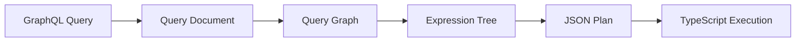

The Query Compiler is a core component of Prisma's new architecture that separates query planning (Rust) from query execution (TypeScript with driver adapters).

## Architecture

The Query Compiler architecture consists of three main layers:

<Steps>
  <Step title="Query Graph Building">
    GraphQL-like queries are parsed and transformed into an internal query graph representation. This graph captures the logical structure of the query including relations, filters, and data dependencies.
  </Step>

  <Step title="Query Planning (Rust)">
    The query graph is translated into an optimized expression tree (query plan) by the `query-compiler` crate. This happens entirely in Rust and produces a serializable plan.
  </Step>

  <Step title="Query Execution (TypeScript)">
    The expression tree is interpreted and executed in Prisma Client using driver adapters. The interpreter has no knowledge of connection strings or database specifics.
  </Step>
</Steps>

## Key Components

### Query Graph

The query graph is an intermediate representation that captures:

- **Nodes**: Queries, computations, control flow (if/else, return)
- **Edges**: Data dependencies, execution order, conditional branches
- **Dependencies**: Parent-child relationships and data flow

```rust
pub enum Node {
    Query(Query),
    Empty,
    Flow(Flow),
    Computation(Computation),
}
```

### Expression Tree

The expression tree is the final output of compilation. It's a serializable representation that can be executed by the TypeScript interpreter.

<CodeGroup>
```rust Expression Types
#[derive(Debug, Serialize)]
#[serde(tag = "type", content = "args", rename_all = "camelCase")]
pub enum Expression {
    /// Database query that returns data
    Query(DbQuery),
    
    /// Database query that returns affected rows
    Execute(DbQuery),
    
    /// Sequence of statements
    Seq(Vec<Expression>),
    
    /// Lexical scope with bindings
    Let {
        bindings: Vec<Binding>,
        expr: Box<Expression>,
    },
    
    /// Application-level join
    Join {
        parent: Box<Expression>,
        children: Vec<JoinExpression>,
        can_assume_strict_equality: bool,
    },
    
    /// Conditional execution
    If {
        value: Box<Expression>,
        rule: DataRule,
        then: Box<Expression>,
        r#else: Box<Expression>,
    },
    
    // ... and more
}
```

```typescript TypeScript Interface
interface Expression {
  type: 'query' | 'execute' | 'seq' | 'let' | 'join' | 'if' | ...
  args: {
    // Type-specific arguments
  }
}
```
</CodeGroup>

## Compilation Pipeline

The compilation process follows these stages:



<Steps>
  <Step title="Parse Query Document">
    Parse the incoming GraphQL-like query into a `QueryDocument` structure.

    ```rust
    let request = RequestBody::try_from_str(&request, protocol)?;
    let QueryDocument::Single(op) = request.into_doc(&schema)?;
    ```
  </Step>

  <Step title="Build Query Graph">
    Transform the query document into a query graph that represents dependencies and execution order.

    ```rust
    let graph = QueryGraphBuilder::new(query_schema).build(operation)?;
    ```
  </Step>

  <Step title="Translate to Expression Tree">
    Walk the query graph and generate an optimized expression tree.

    ```rust
    let plan = translate(graph, &query_builder)?;
    ```
  </Step>

  <Step title="Simplify and Optimize">
    Apply simplification rules to reduce redundant expressions.

    ```rust
    plan.simplify();
    ```
  </Step>

  <Step title="Serialize to JSON">
    Convert the expression tree to JSON for transmission to TypeScript.

    ```rust
    plan.serialize(&RESPONSE_SERIALIZER)?
    ```
  </Step>
</Steps>

## Main Entry Point

The primary compilation function is straightforward:

```rust
pub fn compile(
    query_schema: &QuerySchema,
    query: Operation,
    connection_info: &ConnectionInfo,
) -> Result<Expression, CompileError> {
    let ctx = Context::new(connection_info, None);
    let graph = QueryGraphBuilder::new(query_schema).build(query)?;

    let res = match connection_info.sql_family() {
        SqlFamily::Postgres => translate(graph, &SqlQueryBuilder::<Postgres>::new(ctx)),
        SqlFamily::Mysql => translate(graph, &SqlQueryBuilder::<Mysql>::new(ctx)),
        SqlFamily::Sqlite => translate(graph, &SqlQueryBuilder::<Sqlite>::new(ctx)),
        SqlFamily::Mssql => translate(graph, &SqlQueryBuilder::<Mssql>::new(ctx)),
    };

    res.map_err(CompileError::TranslateError)
}
```

## Dependencies

Key crates used by the query compiler:

| Crate | Purpose |
|-------|--------|
| `psl` | Prisma Schema Language parser and validator |
| `query-structure` | Data structures for queries and schema |
| `query-builder` | SQL query building abstractions |
| `query-core` | Core query graph and document types |
| `sql-query-builder` | Database-specific SQL generation |
| `quaint` | Database connectivity and query execution |

From `query-compiler/Cargo.toml`:

```toml
[dependencies]
psl.workspace = true
query-structure.workspace = true
query-builder.workspace = true
query-core.workspace = true
sql-query-builder = { workspace = true, features = ["relation_joins"]}
quaint.workspace = true
```

## Expression Simplification

The compiler applies several optimization passes:

- **Single-element sequences**: `Seq([expr])` becomes `expr`
- **Identity let bindings**: `let x = e in x` becomes `e`
- **Single-element aggregates**: `Concat([expr])` becomes `expr`
- **Nested simplification**: Recursively simplifies all sub-expressions

## Error Handling

Compilation can fail at multiple stages:

```rust
#[derive(Debug, Error)]
pub enum CompileError {
    #[error("only a single query can be compiled at a time")]
    UnsupportedRequest,

    #[error("failed to build query graph: {0}")]
    GraphBuildError(#[from] QueryGraphBuilderError),

    #[error("{0}")]
    TranslateError(#[from] TranslateError),
}
```

## Design Principles

<CardGroup cols={2}>
  <Card title="Separation of Concerns" icon="layer-group">
    Planning happens in Rust for performance and type safety. Execution happens in TypeScript for flexibility and ecosystem integration.
  </Card>

  <Card title="Database Agnostic Planning" icon="database">
    The expression tree is database-agnostic. Database-specific details are handled during execution via driver adapters.
  </Card>

  <Card title="Serializable Plans" icon="file-export">
    Expression trees serialize to JSON, enabling cross-language execution and potential caching.
  </Card>

  <Card title="Composable Expressions" icon="puzzle-piece">
    Expressions compose naturally, enabling complex queries through simple building blocks.
  </Card>
</CardGroup>

## Next Steps

<CardGroup cols={2}>
  <Card title="Driver Adapters" icon="plug" href="/query-compiler/driver-adapters">
    Learn about the driver adapter system and TypeScript integration
  </Card>

  <Card title="Query Planning" icon="sitemap" href="/query-compiler/query-planning">
    Deep dive into how query planning works
  </Card>

  <Card title="WASM Build" icon="cube" href="/query-compiler/wasm-build">
    Build the WebAssembly module for browser/edge environments
  </Card>
</CardGroup>
