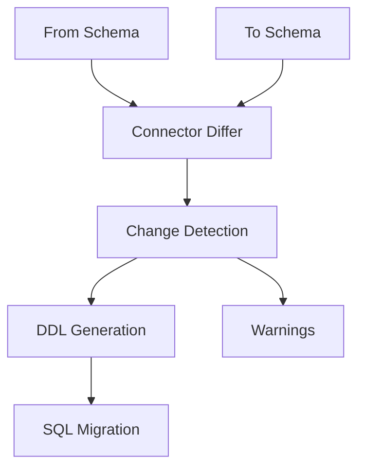

Schema diffing is the process of comparing two database schemas and generating the SQL statements needed to transform one into the other. This is the core mechanism behind Prisma Migrate's declarative workflow.

## Overview

Diffing powers several critical features:

- **Migration generation** (`migrate dev`) - Diff Prisma schema vs. current database
- **Drift detection** - Compare applied migrations vs. actual schema
- **Schema comparison** - Understand differences between environments
- **Migration preview** - See what will change before applying

<Note>
Diffing is **declarative** - you define the desired end state, and the Schema Engine figures out how to get there.
</Note>

## How Diffing Works

The diffing process involves multiple steps:



### 1. Load Schemas

Both "from" and "to" schemas are loaded into the internal `DatabaseSchema` representation. Sources can be:

- **Prisma schema file** - Parsed and converted to database schema
- **Existing database** - Introspected via connector
- **Migration history** - Applied to shadow database
- **Empty schema** - For initial migrations

### 2. Structural Comparison

The connector's differ walks both schemas and identifies:

- Added tables/columns/indexes
- Removed tables/columns/indexes
- Modified types, defaults, constraints
- Renamed entities
- Changed relationships

### 3. DDL Generation

Database-specific SQL is generated to effect the changes:

```sql
-- Added columns
ALTER TABLE "User" ADD COLUMN "email" TEXT NOT NULL;

-- Modified columns
ALTER TABLE "Post" ALTER COLUMN "published" SET DEFAULT true;

-- New indexes
CREATE INDEX "User_email_idx" ON "User"("email");

-- New tables
CREATE TABLE "Comment" (
    "id" SERIAL PRIMARY KEY,
    "content" TEXT NOT NULL,
    "postId" INTEGER NOT NULL,
    FOREIGN KEY ("postId") REFERENCES "Post"("id")
);
```

### 4. Warning Detection

The `DestructiveChangeChecker` analyzes changes for potential issues:

- Data loss (dropped tables/columns)
- Type changes that might fail
- Added non-nullable columns without defaults
- Constraint violations

## The diff Command

The `diff` method is exposed via JSON-RPC:

```typescript
interface DiffParams {
  from: DiffTarget;
  to: DiffTarget;
  script: boolean;      // Output SQL or summary?
  exitCode: boolean;    // Return exit code 2 if diff?
  filters: SchemaFilter;
}
```

### Diff Targets

Both `from` and `to` can be:

#### 1. Empty Schema

```json
{ "type": "empty" }
```

Represents a completely empty database.

#### 2. Schema Datasource

```json
{
  "type": "schemaDatasource",
  "files": [
    { "path": "schema.prisma", "content": "..." }
  ]
}
```

Uses the current **database** referenced by the Prisma schema (introspects it).

#### 3. Schema Datamodel

```json
{
  "type": "schemaDatamodel",
  "files": [
    { "path": "schema.prisma", "content": "..." }
  ]
}
```

Uses the **Prisma schema itself** as the source (without touching the database).

#### 4. Migration History

```json
{
  "type": "migrations",
  "lockfile": "...",
  "migrations": [...]
}
```

Applies migrations to a shadow database and introspects the result.

<Warning>
The `url` diff target type has been removed. Use schema-based targets instead.
</Warning>

## Migration Generation Workflow

When you run `prisma migrate dev`, here's what happens:

### Step 1: Determine Current State

The Schema Engine needs to know the current schema state:

1. Connect to shadow database (or create one)
2. Apply **all existing migrations** to the shadow database
3. Introspect the shadow database
4. This introspected schema is the "from" state

<Accordion title="Why use a shadow database?">

The shadow database is necessary because:

- Migrations are **black boxes** (can contain arbitrary SQL)
- Schema Engine doesn't parse SQL
- The only way to know what migrations do is to **run them**
- Running them on your dev database would be destructive

The shadow database is ephemeral and can be safely reset.

</Accordion>

### Step 2: Determine Desired State

The "to" schema comes from your Prisma schema file:

1. Parse the Prisma schema
2. Convert it to the internal `DatabaseSchema` representation
3. This is the "to" state

### Step 3: Generate Diff

Compare the two schemas:

```rust
let migration = dialect.diff(from_schema, to_schema, &filter);
```

This returns a connector-specific `Migration` object containing:

- DDL statements to execute
- Warnings about destructive changes
- Metadata about the changes

### Step 4: Render Migration File

The migration is rendered as SQL:

```rust
let sql = dialect.render_script(&migration, &Default::default())?;
```

The SQL is written to a new migration file:

```
migrations/
  20240301120000_add_email/
    migration.sql
```

### Step 5: Apply and Verify

The new migration is applied to your dev database and the shadow database is reset.

## Diff Output Formats

### Summary Mode

When `script: false`, returns a human-readable summary:

```
[+] Added tables
  - Comment

[*] Changed the `User` table
  [+] Added column `email`
  [+] Added index `User_email_idx`

[*] Changed the `Post` table
  [*] Changed column `published` (default changed)
```

### Script Mode

When `script: true`, returns executable SQL:

```sql
-- CreateTable
CREATE TABLE "Comment" (
    "id" SERIAL PRIMARY KEY,
    "content" TEXT NOT NULL,
    "postId" INTEGER NOT NULL,
    CONSTRAINT "Comment_postId_fkey" FOREIGN KEY ("postId") 
        REFERENCES "Post"("id") ON DELETE RESTRICT ON UPDATE CASCADE
);

-- AlterTable
ALTER TABLE "User" ADD COLUMN "email" TEXT NOT NULL;

-- CreateIndex
CREATE INDEX "User_email_idx" ON "User"("email");
```

### Exit Codes

When `exitCode: true`:

- `0` - No differences
- `2` - Differences detected

Useful in CI to detect drift:

```bash
schema-engine diff --exit-code && echo "No drift" || echo "Drift detected!"
```

## Destructive Changes

The `DestructiveChangeChecker` identifies changes that might cause data loss or failures:

### Warnings

```rust
pub struct MigrationWarning {
    /// Human-readable description
    pub description: String,
    /// Structured warning type
    pub step_index: usize,
}
```

Example warnings:

- **Dropped table**: "You are about to drop the `User` table. All data will be lost."
- **Dropped column**: "You are about to drop the column `email` on the `User` table. All data in the column will be lost."
- **Type change**: "You are changing the type of `age` from `String` to `Int`. This may fail if the data cannot be cast."

### Unexecutable Migrations

```rust
pub struct UnexecutableMigration {
    /// Why this migration cannot be executed
    pub description: String,
}
```

Example unexecutable migrations:

- **Added non-nullable column without default**: "Cannot add required column `email` without a default value to existing rows."
- **Added unique constraint on non-unique data**: "Cannot add unique constraint on `email` because duplicate values exist."

<Warning>
Unexecutable migrations will **prevent migration creation**. You must modify your schema or add migration steps to handle the issue.
</Warning>

## Rename Detection

Diffing can detect renames vs. drop+create:

### Without Rename Tracking

```sql
ALTER TABLE "User" DROP COLUMN "name";
ALTER TABLE "User" ADD COLUMN "fullName" TEXT;
```

❌ **Data is lost**

### With Rename Tracking

```sql
ALTER TABLE "User" RENAME COLUMN "name" TO "fullName";
```

✅ **Data is preserved**

Prisma uses heuristics to detect renames:

- Similar names (edit distance)
- Same type
- Position in table
- Annotations (`@map`)

<Note>
You can manually edit generated migrations to change DROP+CREATE into RENAME when the differ doesn't detect it.
</Note>

## Database-Specific Diffing

Each connector implements its own differ:

### PostgreSQL

- Full DDL support
- Enums, arrays, composite types
- Advanced constraints
- Schema/namespace handling

### MySQL

- Limited DDL (can't modify multiple columns in one statement on older versions)
- No transactional DDL
- Storage engine considerations

### SQL Server

- Schema-qualified names
- Different default handling
- Identity columns vs. sequences

### SQLite

- Very limited ALTER TABLE support
- Often requires table recreation
- No DROP COLUMN before 3.35.0

### MongoDB

- No traditional migrations
- Schema is implicit
- Limited diffing support

<Accordion title="SQLite migration strategy">

Because SQLite doesn't support most ALTER TABLE operations, the differ generates:

1. Create new table with desired schema
2. Copy data from old table to new table
3. Drop old table
4. Rename new table to old name
5. Recreate indexes and triggers

This is **slow and risky** with large datasets.

</Accordion>

## Schema Filters

The `SchemaFilter` controls what's compared:

```rust
pub struct SchemaFilter {
    /// Schemas/namespaces to include
    schemas: Vec<String>,
    /// Tables to exclude
    excluded_tables: Vec<String>,
}
```

Useful for:

- Multi-tenant databases
- Excluding non-Prisma tables
- Focusing on specific schemas

## Implementation Details

### Connector Trait

```rust
pub trait SchemaDialect {
    fn diff(
        &self,
        from: DatabaseSchema,
        to: DatabaseSchema,
        filter: &SchemaFilter,
    ) -> Migration;
    
    fn render_script(
        &self,
        migration: &Migration,
        diagnostics: &DestructiveChangeDiagnostics,
    ) -> ConnectorResult<String>;
    
    fn migration_summary(
        &self,
        migration: &Migration,
    ) -> String;
    
    fn migration_is_empty(
        &self,
        migration: &Migration,
    ) -> bool;
}
```

### Key Files

- Diff command: `schema-engine/commands/src/commands/diff.rs`
- Connector trait: `schema-engine/connectors/schema-connector/src/diff.rs`
- SQL differ: `schema-engine/connectors/sql-schema-connector/src/sql_schema_differ/`
- Destructive checker: `schema-engine/connectors/schema-connector/src/destructive_change_checker.rs`

## Best Practices

### 1. Review Generated Migrations

Always review migrations before committing:

```bash
prisma migrate dev --create-only
# Review migration file
# Edit if necessary
prisma migrate dev
```

### 2. Handle Unexecutable Migrations

When adding non-nullable columns:

```sql
-- Generated (unexecutable)
ALTER TABLE "User" ADD COLUMN "email" TEXT NOT NULL;
```

Edit to:

```sql
-- Make it nullable first
ALTER TABLE "User" ADD COLUMN "email" TEXT;

-- Backfill data
UPDATE "User" SET "email" = 'placeholder@example.com' WHERE "email" IS NULL;

-- Add NOT NULL constraint
ALTER TABLE "User" ALTER COLUMN "email" SET NOT NULL;
```

### 3. Use Transactions

Add `BEGIN;` and `COMMIT;` to migrations when possible (see [migrations guide](/schema-engine/migrations#use-transactions-when-possible)).

### 4. Test in Staging

Always test migrations in a staging environment with production-like data before running in production.

### 5. Preserve Custom SQL

Generated migrations can be edited to add:

- Custom indexes
- Triggers
- Views
- Functions
- Row-level security policies

The differ will respect custom SQL in **existing** migrations but won't understand it when diffing.

## Comparison with Other Tools

### vs. Liquibase/Flyway

Those tools require you to write migrations manually. Prisma:

- ✅ Generates migrations automatically
- ✅ Detects schema changes
- ❌ Less control over exact SQL

### vs. Entity Framework Migrations

Entity Framework is similar but:

- Prisma uses actual database introspection (shadow DB)
- Entity Framework uses in-memory models
- Prisma handles arbitrary SQL in migrations

### vs. Django Migrations

Django is similar but:

- Django uses Python-based migrations
- Prisma uses SQL migrations
- Django's migration graph is more complex

### vs. db push

`prisma db push` is **not** migration-based:

- No migration files generated
- No history tracking
- Immediate schema sync
- Good for development, **not for production**

<Warning>
Never use `db push` in production. Always use `migrate deploy` with version-controlled migrations.
</Warning>

## Related Documentation

<CardGroup cols={2}>
  <Card title="Migration System" icon="database" href="/schema-engine/migrations">
    Learn how generated migrations are tracked and applied
  </Card>
  <Card title="Introspection" icon="magnifying-glass" href="/schema-engine/introspection">
    Understand how database schemas are read
  </Card>
  <Card title="Schema Engine Overview" icon="cubes" href="/schema-engine/overview">
    High-level architecture and concepts
  </Card>
</CardGroup>
