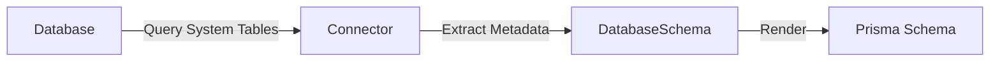

Introspection is the process of analyzing an existing database and generating a Prisma schema that represents its structure. The Schema Engine can introspect tables, columns, indexes, relations, views, and database-specific features.

## Overview

Introspection enables:

- **Greenfield projects** - Generate Prisma schema from an existing database
- **Schema updates** - Detect changes made outside Prisma Migrate
- **Database-first workflows** - Use native DB tools while keeping Prisma schema in sync
- **Migration generation** - Understand current state to diff against desired state

<Note>
Introspection is read-only. It never modifies your database, only reads its structure.
</Note>

## How Introspection Works

The Schema Engine performs introspection through connector-specific implementations:



### 1. System Catalog Queries

Each connector queries database-specific system tables:

- **PostgreSQL**: `information_schema`, `pg_catalog`
- **MySQL**: `information_schema`, `SHOW` commands
- **SQL Server**: `sys.tables`, `sys.columns`, etc.
- **SQLite**: `sqlite_master`, `PRAGMA` commands
- **MongoDB**: Collection scanning and sampling

### 2. Schema Extraction

The connector builds an internal `DatabaseSchema` representation containing:

- Tables and views
- Columns with types, nullability, defaults
- Primary keys and unique constraints
- Foreign key relationships
- Indexes
- Enums (where supported)
- Sequences and defaults
- Database-specific attributes

### 3. Datamodel Rendering

The `datamodel-renderer` crate transforms the `DatabaseSchema` into PSL (Prisma Schema Language):

```rust
model User {
  id        Int      @id @default(autoincrement())
  email     String   @unique
  name      String?
  posts     Post[]
  createdAt DateTime @default(now())
}

model Post {
  id       Int    @id @default(autoincrement())
  title    String
  content  String?
  authorId Int
  author   User    @relation(fields: [authorId], references: [id])
}
```

## Introspection Result

The `IntrospectionResult` structure returned by connectors contains:

```rust
pub struct IntrospectionResult {
    /// Generated Prisma schema files (name, content)
    pub datamodels: Vec<(String, String)>,
    
    /// Whether the database is empty
    pub is_empty: bool,
    
    /// Warnings about introspection issues
    pub warnings: Option<String>,
    
    /// View definitions (if views preview enabled)
    pub views: Option<Vec<ViewDefinition>>,
}
```

### View Definitions

When the views preview feature is enabled:

```rust
pub struct ViewDefinition {
    /// Database/schema name
    pub schema: String,
    
    /// View name
    pub name: String,
    
    /// SQL definition of the view
    pub definition: String,
}
```

<Accordion title="Why are views separate?">
Views are stored separately because:

1. The SQL definition needs to be preserved exactly
2. Views might use database-specific syntax
3. They're optional (requires preview feature)
4. They need special handling during migration generation

</Accordion>

## Introspection Features

### Multi-Schema Support

With the `multiSchema` preview feature, introspection can handle databases with multiple schemas:

```typescript
const result = await introspect({
  namespaces: ['public', 'internal', 'audit']
});
```

- Extracts schema/namespace information
- Preserves schema qualifiers in relation definitions
- Respects schema filters

### Composite Types

For databases supporting composite types (PostgreSQL, MongoDB):

```prisma
type Address {
  street String
  city   String
  zip    String
}

model User {
  id      Int     @id
  address Address
}
```

The introspection depth is configurable via `IntrospectionContext`:

```rust
pub struct IntrospectionContext {
    pub composite_type_depth: CompositeTypeDepth,
    // ...
}

pub enum CompositeTypeDepth {
    /// Don't introspect composite types
    None,
    /// Introspect up to N levels deep
    Level(usize),
    /// Introspect all levels
    Infinite,
}
```

### Relation Inference

The Schema Engine infers relations from:

- Foreign key constraints (explicit)
- Naming conventions (implicit)
- Join tables (many-to-many)

<Warning>
Implicit relations (without foreign keys) are inferred based on naming patterns. Always verify inferred relations match your intent.
</Warning>

### Index and Constraint Discovery

Introspection captures:

- **Primary keys**: `@id`, `@@id`
- **Unique constraints**: `@unique`, `@@unique`
- **Indexes**: `@@index`
- **Foreign keys**: `@relation`
- **Check constraints**: (where supported)
- **Default values**: `@default()`

## Introspection Warnings

Introspection may generate warnings for:

### Unsupported Types

Types that don't map cleanly to Prisma:

```
⚠ These fields are not supported:
  • User.metadata: JSON (not supported yet)
  • Post.tags: ARRAY (PostgreSQL-specific)
```

These fields are commented out in the schema:

```prisma
model User {
  id       Int    @id
  // metadata Json?  // This type is not yet supported
}
```

### Naming Collisions

When database names conflict with Prisma reserved words:

```
⚠ These names were changed:
  • Table "user" → model "user_table" (user is reserved)
  • Field "type" → field "type_field" (type is reserved)
```

### Missing Relations

Foreign keys without corresponding tables:

```
⚠ Incomplete relations:
  • User.organizationId references Organization.id, but Organization doesn't exist
```

### Re-introspection Changes

When re-introspecting an existing schema:

```
⚠ Manual changes will be lost:
  • Custom model names
  • Custom field names
  • Relation names
  • Comments
```

<Warning>
Re-introspection **overwrites** your Prisma schema. Always commit changes before re-introspecting, or use version control.
</Warning>

## Introspection Context

The `IntrospectionContext` controls behavior:

```rust
pub struct IntrospectionContext {
    /// How deep to introspect composite types
    pub composite_type_depth: CompositeTypeDepth,
    
    /// Previous datamodel (for re-introspection)
    pub previous_schema: Option<psl::ValidatedSchema>,
    
    /// Render configuration
    pub render_config: RenderConfig,
}
```

### Re-introspection

When `previous_schema` is provided:

- Preserves custom model/field names (via `@map`, `@@map`)
- Keeps relation names
- Retains comments and documentation
- Warns about unavoidable changes

## SQL Introspection

The `introspectSql` method analyzes SQL queries and returns type information:

```rust
pub struct IntrospectSqlQueryInput {
    /// Name for this query
    pub name: String,
    
    /// SQL query text
    pub source: String,
}

pub struct IntrospectSqlResult {
    /// Parsed queries with type information
    pub queries: Vec<IntrospectedQuery>,
}
```

This powers Prisma's [TypedSQL feature](https://www.prisma.io/docs/concepts/components/prisma-client/raw-database-access/typedsql), enabling type-safe raw SQL queries.

<Accordion title="How SQL introspection works">

1. Parse the SQL query
2. Extract parameter placeholders
3. Determine result column types
4. Map database types to TypeScript types
5. Generate TypeScript definitions

This is database-specific - each connector implements its own SQL parser/analyzer.

</Accordion>

## Schema Filters

Introspection respects `SchemaFilter` to limit what's introspected:

```rust
pub struct SchemaFilter {
    /// Tables/views to include
    includes: Vec<Pattern>,
    
    /// Tables/views to exclude
    excludes: Vec<Pattern>,
}
```

Useful for:

- Excluding internal/system tables
- Focusing on specific schemas
- Ignoring legacy tables
- Performance optimization

## JSON-RPC Method

Introspection is exposed via the `introspect` JSON-RPC method:

```json
{
  "jsonrpc": "2.0",
  "method": "introspect",
  "params": {
    "force": false,
    "compositeTypeDepth": -1,
    "namespaces": ["public"]
  },
  "id": 1
}
```

**Parameters:**

- `force`: Re-introspect even if schema exists
- `compositeTypeDepth`: How deep to introspect composite types (-1 = infinite)
- `namespaces`: List of schemas to introspect

## Implementation Details

### Connector Trait

All connectors implement:

```rust
#[async_trait]
pub trait SchemaConnector {
    async fn introspect(
        &mut self,
        ctx: &IntrospectionContext,
    ) -> ConnectorResult<IntrospectionResult>;
    
    async fn introspect_sql(
        &mut self,
        input: IntrospectSqlQueryInput,
    ) -> ConnectorResult<IntrospectedQuery>;
}
```

### Key Files

- Trait definition: `schema-engine/connectors/schema-connector/src/schema_connector.rs`
- SQL implementation: `schema-engine/connectors/sql-schema-connector/src/introspection/`
- MongoDB implementation: `schema-engine/connectors/mongodb-schema-connector/src/`
- Datamodel rendering: `schema-engine/datamodel-renderer/src/`

## Best Practices

### 1. Commit Before Introspecting

Always commit your current schema before running introspection:

```bash
git add prisma/schema.prisma
git commit -m "Before introspection"
prisma db pull
```

### 2. Review Generated Schema

Carefully review:

- Inferred relations (especially without FK constraints)
- Type mappings
- Naming changes
- Missing or commented-out fields

### 3. Add Custom Attributes

After introspection, add:

- `@map` and `@@map` for readable names
- Relation names
- Comments and documentation
- Validation rules

### 4. Use Schema Filters

Exclude unnecessary tables:

```prisma
generator client {
  provider = "prisma-client-js"
}

datasource db {
  provider = "postgresql"
}

// Manually filter during introspection
```

<Note>
Schema filtering is configured via the JSON-RPC API, not in the schema file itself.
</Note>

## Related Documentation

<CardGroup cols={2}>
  <Card title="Schema Diffing" icon="code-compare" href="/schema-engine/diffing">
    Learn how introspection feeds into migration generation
  </Card>
  <Card title="Migration System" icon="database" href="/schema-engine/migrations">
    Understand how introspected schemas interact with migrations
  </Card>
</CardGroup>
